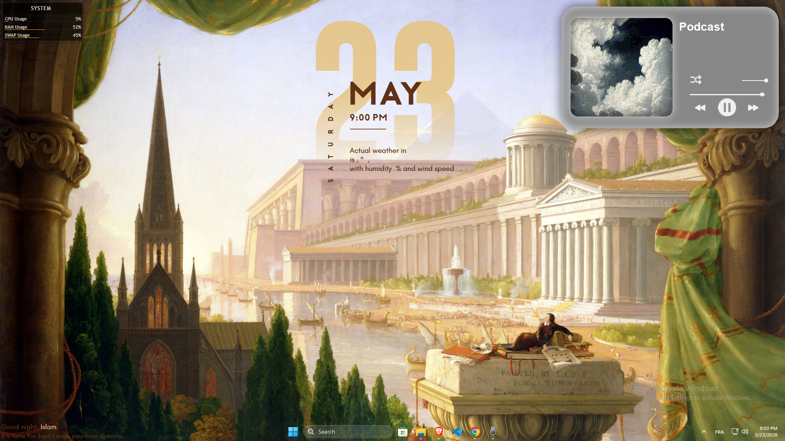
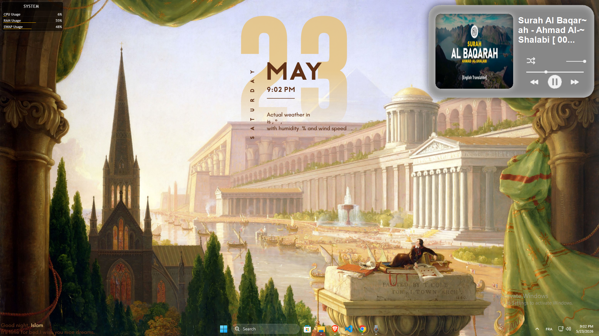

# CozyCorner

CozyCorner is a lightweight floating desktop audio player built with PyQt6 and VLC.
it quickly plays local audio files and YouTube audio streams without needing to open heavy apps or browser tabs.

## What It Solves

Most modern media playback happens through browsers or large desktop apps that consume a lot of RAM and clutter the desktop with tabs and windows.

CozyCorner provides:
- quick audio playback,
- instant desktop access,
- lightweight usage compared to browser playback,
- and a minimal floating interface directly on the desktop.

## Features

- Local audio playback
- YouTube audio streaming
- floating desktop UI
- System tray controls
- Global hotkeys
- Volume control
- Shuffle support
- Arabic title support

## Controls

---

- ctrl + shift + space → chose file  
- ctrl + shift → chose folder  
- y + shift → youtube url   

---

## Preview

---

---

---
